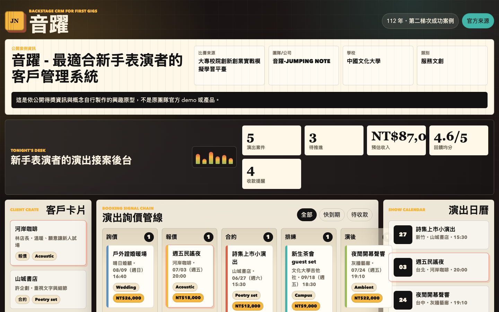
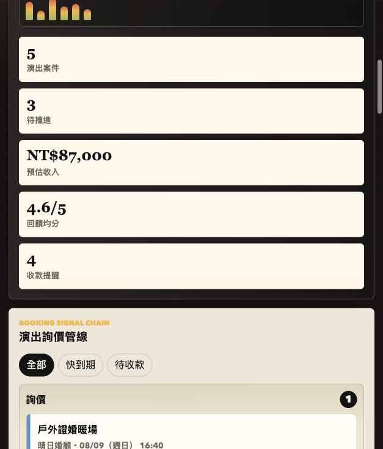

# 音躍 - 最適合新手表演者的客戶管理系統

## 快速看懂

- 線上 Demo：https://atlasforcn.github.io/startup-jumping-note-performer-crm/
- 這個原型在做什麼：把音躍做成新手表演者演出客戶管理 CRM。
- 特色定位：特色是把接案管線、演出準備、合約報價與演後回饋都包進音樂工作者場景。
- 操作流程：整理演出詢價與客戶卡片 → 追蹤報價、合約、曲目與設備需求 → 管理演出日曆、收款提醒與演後回饋

展開完整功能流程截圖

這是一個可直接用瀏覽器開啟的純前端靜態 demo，將「音躍-JUMPING NOTE」公開案例概念延伸成新手表演者使用的後台 CRM 工作台。介面以舞台後台與音樂工作室為視覺語彙，聚焦在接案、演出準備、客戶維繫與演後追蹤。

## 比賽與來源資訊

- 比賽來源：大專校院創新創業實戰模擬學習平臺
- 年度：112 年（2023）
- 屆次/階段：第二梯次成功案例
- 團隊/公司：音躍-JUMPING NOTE
- 學校：中國文化大學
- 類別：服務文創
- 作品名稱：音躍 - 最適合新手表演者的客戶管理系統
- 官方來源：https://ssp.moe.gov.tw/cases/909

## Demo 功能

- 演出詢價管線：依詢價、報價、合約、排練、演後追蹤分欄管理。
- 客戶卡片：快速查看場地方、聯絡窗口、風格偏好與最近動態。
- 報價與合約狀態：在選取案件後可直接切換目前階段。
- 曲目與設備需求：每個演出案都有曲目、設備與現場備註。
- 演出日曆：列出近期演出與前置時程，點選即可切換案件。
- 訊息模板：依目前案件產生回覆、報價、催款與演後感謝訊息。
- 收款提醒：標記訂金或尾款是否已處理。
- 演後回饋：新增客戶回饋與評分，用於後續維繫。

## 使用方式

直接開啟 `index.html` 即可使用。這個 demo 不需要建置工具、套件安裝或網路資源，可存放在 GitHub Pages。

## 檔案

- `index.html`：靜態頁面結構與案例資訊。
- `styles.css`：舞台後台風格的響應式樣式。
- `app.js`：CRM 範例資料、互動與本機狀態儲存。
- `SOURCE.md`：資料來源與轉化說明。

## 免責聲明

這是依公開得獎資訊與概念自行製作的興趣原型，不是原團隊官方 demo 或產品。

## 8 位專家補強

- 使用者與痛點：新手表演者需要集中管理詢價、檔期、合約、款項與演後關係。
- 市場與差異：替代方案是行事曆、試算表與通訊軟體；差異在表演工作流、報價版本與回訪。早期客群從校園與小型表演者導入。
- 驗證：記錄詢價轉換、成交、準時收款、取消、演後回饋、重複邀約與收入成效指標。
- 商業模式：個人依月付費訂閱，團隊方案與金流整合另行報價；收入、通知、儲存、客服成本與毛利需驗證。
